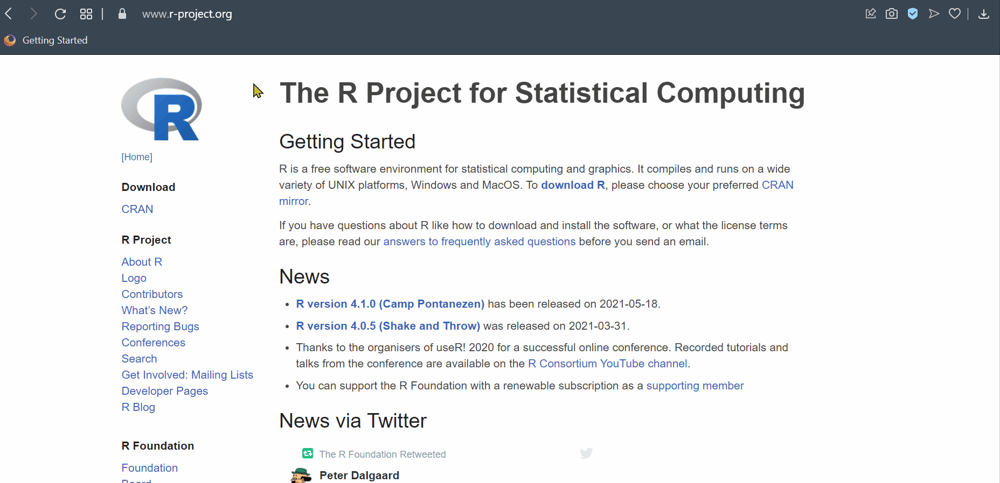
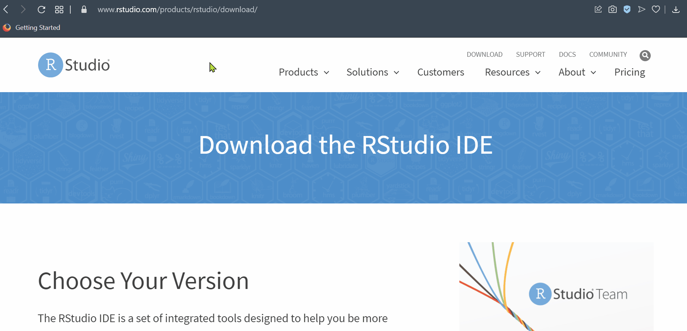
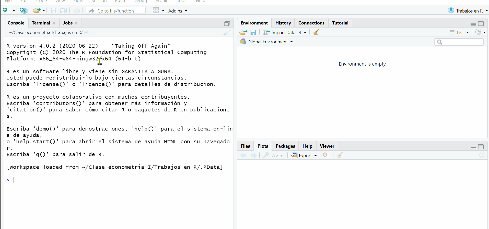

```{r setup, include=FALSE}
library(flextable)
library(extrafont)
library(kableExtra)
library(tidyverse)
knitr::opts_chunk$set(echo = TRUE)
```

# Presentación

Para esta ocasión de trabajo se utilizará el Software de R. El cual es: _Un lenguaje de programación  de código abierto y que es enfocado en el análisis de datos, especialmente en el tema estadístico._ Sus creadores son Robert Gentleman y Ross Ihaka. En el link de <https://www.r-project.org/index.html> podrá encontrar todo lo relacionado con el programa que usaremos.

```{r rclav, echo=FALSE, out.width='75%', fig.align='center'}
knitr::include_graphics("images/Rlogo.png")
```

Los complementos y bases de este curso regularmente son demos de otras bases reales o utilizadas en los distintos textos de econometría que han venido realizando investigación empírica.

Muchos de los comandos y códigos aquí utilizados fueron tomados del sitio web de Florian Heiss: <http://www.urfie.net/> que hace referencia al uso de **R** en la Econometría.

## Primeros pasos

Lo primero es ir a la pagina de <https://www.r-project.org> e ir a la pestaña de **CRAN** y descargar la versión de acuerdo al sistema **operativo** que usted tenga, llamese Linux, Windows o IOS.



Despues de haber instalado el programa, urge ir al link de [R Studio](https://rstudio.com/products/rstudio/download/) que es un potente aliado^[Para mayor información consulte la pagina web o enlace de **R Studio**.] en el entorno de ejecución del programa **R**, se le denomina IDE Por sus siglas en ingles significa _Integrated Drive Electronics_, no es mas que un entorno de desarrollo interactivo que facilita interactuar mejor y de manera mas "amigable" con todos los asuntos de los lenguajes de programación.



Debe ir por lo pronto a la sección **free**, esperar el tiempo de acuerdo a la _velocidad de conexión_ y luego ejecutarlo. Ya después de eso podrá interactuar mejor con **R** y visualmente todo será mejor para el trabajo.

## Script o Bitacoras

Siempre es bueno crear unas notas de código. Es una especie de cuaderno que le permite tener apuntes o escritos para saber que va haciendo linea a linea, incluso le sirve como un historial de desarrollo, de todas maneras **R** tiene su propio, pero es _altamente_ recomendable que usted lo maneje de esta forma. Lo puede hacer en formato _texto_ o _txt_ del block de notas en su **sistema operativo** o también directamente desde el programa de **R studio** solo presionando las teclas `ctrl+shift+N` o de esta manera en el menú principal:



Note que **R Studio** trabaja con 3 ventanas principales, estas son la de _consola_, _Environment_ y _File_, todas tienen sus respectivas pestañas que le serán funcionales a la hora de hacer sus proyectos.

## Primeros calculos

Para esta parte del curso, se establecerán algunos cálculos y operaciones básicas ya mostradas en los vídeos tutoriales de la clase y que se encuentran alojados en la carpeta de contenido en el blackboard. Esta primera parte solo tiene cálculos básicos y operaciones de tipo calculadora tal cual el programa así lo permite. Ejemplo: 

```{r calc, eval=FALSE}
  3+5 # Una suma o adición
  1255*sqrt(25) # Producto con la raíz cuadrada de 25
  13**2 # Potencia de un número
  300/25 # Simple división
```

Note que el (#) es para decirle al programa que no ejecute lo que se encuentra después de él, se usa para tomar notas o escribir algo al respecto, por ejemplo:

```{r numeral, eval=FALSE}
# Soy carlos yanes
```

Para la parte de asignación de valores a una variable (X) -puede darle el nombre que le desee colocar- se tiene que:

```{r operation, eval=FALSE}
  a<-2
  a=2 # También se puede usar el igual
  a^2 # El cuadrado de esa variable
  abs(a) # Valor absoluto de la variable
  sqrt(a) # Raíz cuadrada de la variable
  log(a) # Logaritmo natural
  log(a,b) # Logaritmo con base al valor b correspondiente,
  exp(a) # Valor Exponencial de a
  factorial(a) # Factor de a
```

En economía y en muchas ciencias sociales se hace uso extensivo de las **matemáticas** y de la **estadística**. Muchas veces será incluso necesario calcular o realizar algunas transformaciones en las variables para poder tener unas métricas mas informativas como son los _logaritmos_, _valores absolutos_, valores de forma _exponencial_ o de notación científica, entre otros. Algunos comandos que se pueden usar en **R** para eso son:

| Operación     | Resultado     |
| ------------- | ------------- |
| Valor absoluto| abs()         |
| Logaritmo     | log()         |
| Logaritmo base| log(,)        |
| Exponencial   | exp()         |
| Factorial     | factorial()   |
| Raíz cuadrada | sqrt()        |

El *valor absoluto* de un número como por ejemplo puede ser simplemente:

```{r echo=TRUE}
  abs(-3) # Es el valor absoluto de (-3)
```
Sin embargo, en una operación conjunta, si se posee una lista de elementos o un **vector** de elementos, es mucho mas simple implementarlo de tal forma que:

```{r echo=TRUE}
  x<-c(-5,-19,3,11,-16,18,21,-31,-33) # Lista de valores
  abs(x)
```
De igual forma, funciona con un *logaritmo* o también una operación que involucre una de forma de notación científica o *exponencial*, esto puede notarse así:

```{r echo=TRUE}
  y<-c(15,21,23,29,16,28,32,45,33) # Lista de valores para vector Y
  log(y) #Se calcula el logaritmo de cada uno de los elementos
```
Observe que el **Programa** calcula el logaritmo natural de cada uno de los elementos del vector (y). Para la forma *exponencial*, es de uso de la notación del logaritmo base e y que muchos conocen como la expresión de **Euler**, e.g: $e^{x}$, recuerde ademas que si este lo usamos de tal manera que $Y=ln(e^{x})=x$. Un ejemplo de aplicación es

```{r echo=TRUE}
  x<-150 
  exp(x) # En R exp hace referencia a la formula de (e)
```

Teniendo la asignación de valores a un objeto en **R**, podemos simplificar el uso o calculo de forma considerable.

### Requerimiento

De acuerdo a lo anteriormente expuesto, **responda** y halle lo valores de las siguientes formulas:

1. $\sqrt{2700} + 16700 -1500$.
2. $487000+49900+701000$.
3. $log(400)+log(211)+log(150)$
4. $59^{4} \times 123 \div 20$
5. Cree una variable que contenga el valor de 5800, establezca el logaritmo, valor absoluto y el valor factorial de ella.

## Análisis de vectores

Muchas veces los vectores se convierten o consideran como una lista de elementos que finalmente constituyen una columna de una base de datos o **dataframe**. Para mirar un juego de esto, mire el código a continuación:

```{r sal1}
# Definimos un vector x para todos los años:
anos<- c(2018,2019,2020,2021,2022,2023)
# Definimos una matriz de y valores:
producto1<-c(10,13,16,19,17,18); producto2<-c(21,32,43,15,19,36); producto3<-c(22,43,42,21,32,21)
# Una forma de unir vectores es con el comando cbind
ventas_mat <- cbind(producto1,producto2,producto3) 
# Nombramos las filas con el vector de años:
rownames(ventas_mat) <- anos 
# La matriz de datos es:
ventas_mat
# Creamos un data frame y este se muestra:
ventas <- as.data.frame(ventas_mat)
ventas  
```

Tome a consideración la siguiente tabla de datos:
```{r tab1, echo=FALSE}
datatab<- data.frame(
  Obs=c(1,2,3,4,5,6),
  X1=c(232,345,265,223,148,211),
  X2=c(9871,5432,3251,15478,12370,13150),
  X3=c(121,131,136,138,149,158),
  X4=c(52,90,86,84,72,91)
)
datatab<-flextable(datatab)
datatab<-theme_vanilla(datatab)
datatab<-add_footer_lines(datatab, "Variables númericas")
datatab
```

### Requerimiento

Dado lo anterior

1. Construya un **dataframe** o base de datos con la información de la tabla anterior.
2. Tome y elabore una _tabla_ usted propiamente y construya su propia data frame. Trate de involucrar dos variables que sean de tipo cualitativas y dos cuantitativas y que las observaciones de cada una de ellas sean en total de diez (10).

## Trabajando con Data Frames
Para esta parte es importante mirar todos los elementos de trabajo con las bases y estructuras de datos. En este realizaremos algunas de las operaciones con ellas. Una forma de seleccionar variables es con la indicación del signo $ (pesos), se hace para seleccionar una variable de la tabla de datos.

```{r another}
# Para acceder a una sola variable:
ventas$producto2

# Generar una nueva variable en el data frame
ventas$totalv1 <- ventas$producto1 + ventas$producto2 + ventas$producto3 

# Lo mismo de lo anterior pero usando "with":
ventas$totalv2 <- with(ventas, producto1+producto2+producto3)

# Lo mismo pero usando el comando "attach":
attach(ventas)
ventas$totalv3 <- producto1+producto2+producto3
detach(ventas)

# Resultados:
ventas
```

### Requerimiento
Para colocar esto en practica, **responda las siguientes consideraciones**:

1. Calcule con los datos de la tabla de datos de obs una variable que contenga el logaritmo de X2, el producto de entre X1 y X3 y la raíz cuadrada de X4.
2. De su tabla elaborada (propia), calcule o genere la suma de alguna de sus variables cuantitativas.


