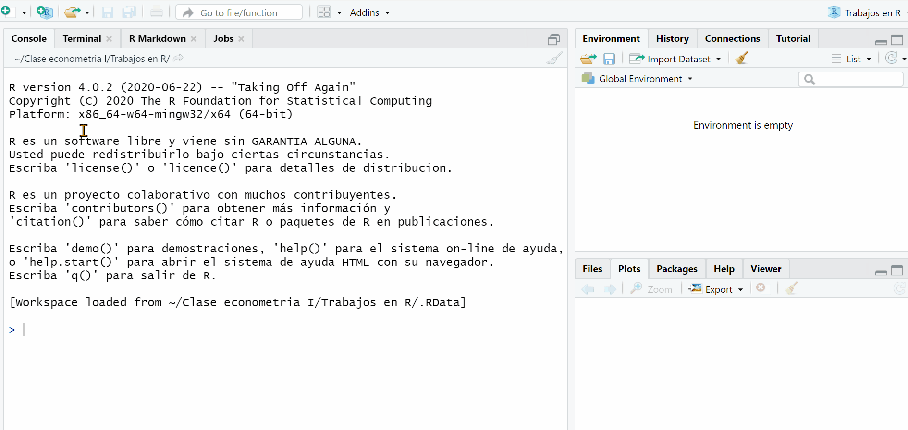
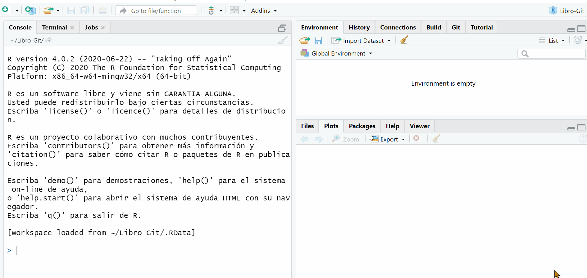

```{r setup, include=FALSE}
library(flextable)
library(extrafont)
library(kableExtra)
library(tidyverse)
knitr::opts_chunk$set(echo = TRUE)
```

# Resumen

Consecuente a lo que venimos haciendo en el curso. Esta parte contiene lo referente a la __importación de datos__ en distintos formatos y las primeras medidas de estadistica conocidas como de __tendencia central__ que se usan para el análisis de datos, al igual que el tema de la distribución de una variable.

## Markdown 

Un compilador potente que permite juntar códigos de **R**, ecuaciones de **LaTeX** y textos para obtener documentos **científicos** ya sea en formato de _html_, _pdf_ y/o _word_. Se puede desplegar desde el menu de **R Studio**. Uuna guía completa de él lo puede hallar en este [enlace](https://bookdown.org/yihui/rmarkdown/) y su creador es 
Yihui Xie.



La clave es ir instalando algunos paquetes adicionales al paquete `Knit` e ir trabajando con las plantillas que involucra el programa.

## Chunks

Los `Chunk` son cuadros para insertar todos los códigos de **R** y el programa los ejecute directamente. Existes opciones de evaluación de celdas y también para gráficar. 

# Importación

Una de las cosas mas requeridas dentro del trabajo de **R** hace referencia a la importación de datos que no son propiamente de el. Aquellos datos o bases regularmente vienen en formatos de xml, csv, dta, asll, etc. Por ende, se hace necesario la implementación de comandos o de la ayuda directa del programa. Los _paquetes_ declarados a continuación permiten realizar esto:

```{R import}
library(foreign)    # Para convertir datos *.dta (STATA)
library(haven)      # Para importar datos de otros programas
library(readxl)     # Para leer archivos de excel

#Ejemplo de una base de datos que esta en excel (debe tener cuidado con la ruta de su computador C:)

Pruebadatos <- read_excel("~/Mi trabajo en R/Guia econometria I/Guia_Econ/GuidesCarp/Guia 02/Prueba.xlsx")

View(Pruebadatos) # Para explorar la base

#Exportar una base de datos desde R a formato CSV de excel con el comando "write"
write.csv(Pruebadatos, file = "archivodeprueba.csv")
```

Otra forma de hacerlo es con la ayuda del menú de __R Studio__ 



Es de recordar que al exportar datos, estos quedan grabados en la carpeta de trabajo^[En la pestaña de files del menú inferior se encuentra la tuerquita (more) que le da la opción de directorio de trabajo] que se le ha establecido al programa desde un inicio.

### Requerimiento

1. Tome el siguiente formato de variables y elabore un archivo excel con ellas.

| Cantidad | Precio | Ingreso |
|----------|--------|---------|
| 23       | 5300   | 185000  |
| 28       | 5100   | 190000  |
| 30       | 5150   | 185000  |
| 36       | 5000   | 182000  |
| 12       | 6900   | 195000  |
| 8        | 7100   | 177500  |
| 6        | 7200   | 111300  |
| 5        | 7900   | 113400  |
| 58       | 2100   | 127200  |
| 54       | 2500   | 125100  |

2. Importe el archivo con un nombre de `Consumo_singular`
3. Muestre el encabezado de la base de datos (ya importada) en R con con el comando: `head(Consumo_singular)`
4. Genere el logaritmo de la  variable _Ingreso_ y añáda a la base de datos.
5. Asuma que le corresponde hacer una actualización de la base. Los valores de esta nueva fila son `8, 7150, 188640`. Agregue y muestre su base.

# Caracterización de los datos

La **importancia** del análisis de datos (EDA) es requerida para tomar decisiones y conocer muy bien lo que cada una de las variables nos esta indicando, es por esto que recurrimos a la _estadística_ y hacemos uso de las distintas medidas de tendencia central ampliamente conocidas como __media__, __desviación estándar__, __asimetría__ y __curtosis__.

$$
\begin{aligned}
    \text{Promedio } =& \frac{\sum \limits_{i=1}^{n} x_{i}}{n} = \bar{X} \\
    \text{Varianza } =& \frac{\sum \limits_{i=1}^{n} (x_{i} - \bar{x})^{2}}{n} = Var(X) \\
    \text{Asimetría (Fisher) }=& \frac{\sum \limits_{i=1}^{n} (x_{i} - \bar{x})^{3}}{\sigma^{3}} = A(x) \\
    \text{Curtosis }= & \frac{\sum \limits_{i=1}^{n} (x_{i} - \bar{x})^{4}}{n\sigma^{2}}-3 = K(x)
\end{aligned}    
$$
_Donde n es el tamaño de la muestra, x las observaciones, $\sigma$ la desviación estándar, $\bar{x}$ la media de la distribución_. Con una base de datos podemos entonces tener:

```{r met1}
# Promedio de una variable:
mean(Pruebadatos$Consumo)

# Mediana:
median(Pruebadatos$Consumo)

#Desviación estándar:
sd(Pruebadatos$Consumo)

# Varianza
var(Pruebadatos$Consumo)

# Un resumen completo
summary(Pruebadatos$Consumo)
```

Que son los cálculos por variable de las primeras medidas de estadística descriptiva. La **interpretación** de cada uno de ellos es vital en el _análisis de datos_. Para el calculo del tercer y cuarto momento hay que hallar y tener en cuenta la instalación del paquete de `moments`

```{r mom}
#Usar paquete # Momentos de la distribución
library(moments) 

#Asimetría
skewness(Pruebadatos$Consumo)

#Curtosis
kurtosis(Pruebadatos$Consumo)
```

En este caso la **asimetría** nos dice que tan sesgada hacia un lado esta la distribución de los datos, la recomendación de _asimetría_ es que esta sea cero (0), o se encuentre cerca de ese valor y la **Kurtosis** el grado de punta que tiene la distribución, se puede de acuerdo al valor obtenido clasificar como:

$$
\begin{aligned}
\text{Mesocurtica}: \; & K = 3  \\
\text{Leptocurtica}: \; & K > 3 \\
\text{Platicurtica}: \; & K < 3
\end{aligned}
$$

### Requerimiento

De acuerdo a lo anteriormente expuesto, responda lo siguiente:

1. De la base `Pruebadatos` seleccione la variable `Ingreso` y realice un análisis de todas las métricas.
2. Haga una lectura correcta de los coeficientes de asimetría y curtosis solo para la variable `Precios`.


## Distribución de una variable

La distribución de una variable $x$ siempre es necesaria. Con esto podemos identificar ciertos patrones comunes.

```{r dist}
#Gráficos esenciales
curve(x^2, -2, 2)
curve(dnorm(x), -3, 3)

#Algunas etiquetas y estilos
curve(dnorm(x,0,1), -10, 10, lwd=1, lty=1)
curve(dnorm(x,0,2), add=TRUE, lwd=2, lty=2)
curve(dnorm(x,0,3), add=TRUE, lwd=3, lty=3)

#De lo anterior pero con etiquetas
#Adición de etiquetas
legend("topleft", expression(sigma==1, sigma==2, sigma==3), lwd=1:3, lty = 1:3)
#Adición de formula centrada en x=6 y y=0.3
text(6, .3,
     expression(f(x)==frac(1, sqrt(2*pi)*sigma)*e^{-frac(x^2, 2*sigma^2)}))
```

La opción de `expression` permite escribir ecuaciones y textos dentro del grafico. Siempre es bueno tener en consideración la posición que queremos que tenga.

### Requerimiento

A continuación **responda** lo siguiente:

1. Construya un gráfico de las expresiones $f(x)= e^{x}$, $f(x)= e^{2x}$, $f(x)= log(x)$  y para $f(x)= x^{1/3}$.
2. Replantee las curvas de la distribución normal asumiendo una media de 20 y una varianza de 2.5, 10, 20 y 30 respectivamente. Analice esta parte.

## Histogramas 

El histograma es uno de los primeros gráficos de uso para conocer mejor el punto de la distribución de variables. Con esto nos indica que proporción de observaciones contiene una característica en particular. Los histogramas pueden señalar que tan asimétricos son las observaciones y si existe o no un sesgo en la cola de la distribución.

```{r Hist}
# Extraer datos para un vector
PRS <- Pruebadatos$Consumo

# Figura (a): histograma (para orden y conteo)
hist(PRS)

# Densidad de la variable y aplicación con colores
d <- density(PRS)
plot(d, main="Densidad Kernel del Consumo")
polygon(d, col="red", border="blue") 

#Densidad con Histograma
x <- Pruebadatos$Consumo
h<-hist(x, breaks=5, col="red", xlab="Consumo en unidades", ylab = "Frecuencia de consumo",
        main="Histograma con curva de la dist. Normal")
xfit<-seq(min(x),max(x),length=40)
yfit<-dnorm(xfit,mean=mean(x),sd=sd(x))
yfit <- yfit*diff(h$mids[1:2])*length(x)
lines(xfit, yfit, col="blue", lwd=2)
```

De lo anterior notamos que el **consumo** tiene una asimetría positiva (la cola de la distribución esta a la derecha) y tiene algunos datos en esa zona. Aunque hay una proporción de personas (40%) que contiene un consumo entre las 15 a 30 unidades respectivamente.

### Requerimiento

1. Establezca una replica del código anterior con las variables `Ingreso` y `precios` de las bases de datos presentadas anteriormente.
2. Plantee diferencias y similitudes entre ambos gráficos.

Recuerde que los _graficos_ que provee **R** como base son muy buenos, sin embargo puede usar otros paquetes como el de `ggplot` que tambien contiene otras mejoras visuales.

```{r visg}
library(ggplot2)
ggplot(Pruebadatos, aes(x = Consumo)) +
  geom_histogram()

# con Barras que decide el(la) autor(a) `binwidth`
ggplot(Pruebadatos, aes(x = Consumo)) +
  geom_histogram(binwidth = 4)
```
