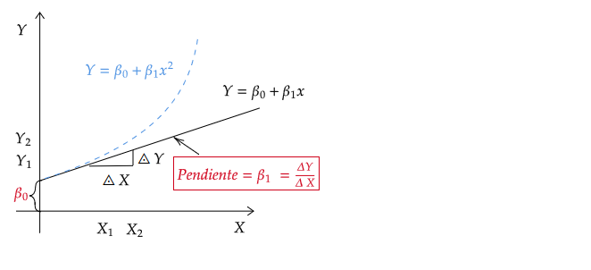

```{r setup, include=FALSE}
options(htmltools.dir.version = FALSE)
library(knitr)
opts_chunk$set(
  fig.align="center",  
  fig.height=4, #fig.width=6,
  # out.width="748px", #out.length="520.75px",
  dpi=300, #fig.path='Figs/',
  cache=T#, echo=F, warning=F, message=F
  )
library(tidyverse)
library(hrbrthemes)
library(fontawesome)
```

layout: true

<!-- this adds the link footer to all slides, depends on my-footer class in css-->

---
name: xaringan-title
class: left, middle, inverse
background-image: url(images/Campus.jpg)
background-size: cover

# Introducción a Econometría

<br/>

<br/>

<br/>


### Carlos Yanes Guerra
.large[Departamento | Economía | 26/07/2021]

<!-- this ends up being the title slide since seal = FALSE-->

---
class: inverse, center, middle
background-image: url(images/logoblancodepar.png)
background-size: contain

<br/>

<br/>

<br/>

<br/>

<br/>
## Empecemos... 
---
class: right, middle

# Yo

`Profesor<-c('Carlos A. Yanes')` 
`r fa('address-book')` [Carlos Andrés Yanes Guerra](https://www.linkedin.com/in/carlos-andres-yanes-guerra-0026bb31/?originalSubdomain=co)

`r fa('envelope')` [cayanes@uninorte.edu.co](mailto:cayanes@uninorte.edu.co)

`r fa('github')` [Github](https://github.com/keynes37)

`r fa('twitter')` [keynes37](https://twitter.com/keynes37)


`r fa('graduation-cap')` Profesor Asistente (Econometría, Microeconomía y algo de Ciencia de Datos) en el Departamento de Economía **Bloque D**.


---
# Lo importante de la sesión:

<span style="color:blue"> **Aprender, preguntar y seguir aprendiendo** </span>

Siempre tengan en cuenta:

- Respeto hacia los demás 
- Asistir a las sesiones virtuales y presenciales en laboratorio uninorte
- Conocer el [Syllabus](https://catalogoweb.uninorte.edu.co/ultra/courses/_34319_1/cl/outline) de la asignatura
- Familiarizarse con los códigos de **R** y de [RStudio IDE](https://www.rstudio.com/products/rstudio/)

--

### Adicionalmente necesita:

--
- Poseer un usuario y cuenta en [Discord](https://discord.com) e inscribirse en el siguiente [link](https://discord.gg/6arh35fQ)
--

- Estar siempre pendiente a los *requerimientos* y [guías](https://github.com/keynes37/Guiaeconometria) del curso que se iran subiendo semana a semana
---
# Vaya a [Discord](https://discord.com) & cree su usuario

```{r echo = FALSE}

```

--

### Recuerde:
- Es un asunto académico, por ende debe tener un **nickname** que lo(a) <span style="color:blue"> **identifique** </span>
- Lea bien las reglas.
- Puede ser Baneado(a) por mal comportamiento.
- No pueden haber otros usuarios apartes al curso.
---
# Sobre las clases I

- Regresamos al campus (aquello(a)s **inscritos**) desde la primera semana del mes de **agosto**.

--

- Debe estar pendiente a los **anuncios** realizados en el BBC el cual le informará de un *cuestionario* a responder para su asistencia al campus por cuestión de aforo en el laboratorio de sistemas ubicado en el *Bloque D* (tercer piso).

--

- Estas serán de forma **Bi-modal** (una parte de nosotros en campus y los otros de forma remota)

---
# Ubicación Laboratorio Economía

```{r out.width='100%', fig.height=6, eval=require('leaflet')}
library(leaflet)
leaflet() %>% addTiles() %>% setView(-74.85045, 11.01903, zoom = 17)
```

---
# Para la entrada (No olvide llenar Reporte)

---
# Sin lo anterior no podrá activar su entrada
```{r carnet, out.width = "120%", echo = FALSE}

```


---
# Instalación de elementos (recuerde)

1. Descargar [R](https://www.r-project.org/).

2. Descargar [RStudio](https://www.rstudio.com/products/rstudio/download/preview/).

3. (Opcional) Descargar [Git](https://git-scm.com/downloads).

---
# A tener en cuenta
| Objeto             | Tipo de trabajo      | Fecha de trabajo        | Ponderación |
|--------------------|----------------------|-------------------------|-------------|
| Primer Parcial     | Examen virtual       | 21 de agosto            | 20%         |
| Segundo Parcial    | Examen virtual       | 18 de septiembre        | 20%         |
| Talleres Prácticos | Talleres en grupo    | a lo largo del semestre | 10%         |
| Trabajo Final      | Se hacen entregables | tres semanas finales    | 20%         |
| Examen final       | Examen virtual       | Por registro acádemico  | 30%         |

---
# Advertencias legales

Los siguientes artículos del *reglamento estudiantil* son de obligatorio cumplimiento:

- <span style="color:red">Artículo 70</span>: Cuando el estudiante falta el 25 % de las clases, no tiene derecho a presentar el **examen final** y su nota será de 0.0 (cero punto cero).

- <span style="color:red"> Artículo 96</span>: Fraude tendrá penalidad de **nota de cero** ya sea en **Parcial**, **Evaluación Final**, **Taller**, **Quíz** o **actividad desarrollada en clases**. La reincidencia será entendida como el desarrollo de un proceso disciplinario con los entes de la Universidad.

---
# Generalidades

- Este curso proporciona una introducción a la econometría utilizando elementos básicos de la **estadística** tanto inferencial como descriptiva, **álgebra matricial** y desde luego **economía**.

--

- La asignatura tiene un enfoque <span style="color:red"> **analítico - práctico** </span>  que le permite a los estudiantes entender la utilización de la *econometría* en la investigación aplicada por parte de los economistas, sus alcances y limitaciones.

---

class: inverse, middle, center
background-image: url(https://upload.wikimedia.org/wikipedia/commons/3/39/Naruto_Shiki_Fujin.svg)
background-size: contain

# ¿Qué es la econometría?

---
# Definición

Aquella **rama** de la economía que combina los estamentos de la <span style="color:red">estadística</span>, la matemática y la <span style="color:red">teoría económica</span>, con el fin de *probar* hipótesis y/o *responder* preguntas a partir de información o datos cuantitativos.

--

"*... El desarrollo de métodos estadísticos que se utilizan para estimar relaciones económicas, probar teorías económicas y evaluar e implementar políticas públicas y de negocios...*" [Wooldridge (2016) ](https://primo-tc-na01.hosted.exlibrisgroup.com/permalink/f/1nls3ib/uninorte_aleph000133994)

--

"*... La ciencia y el arte de utilizar la teoría económica y las técnicas estadísticas para analizar los datos económicos...*" [Stock & Watson (2012)](https://www.amazon.com/Introduction-Econometrics-Stock-James-Watson/dp/935286350X)

---
class: inverse, middle, center

En esta rama todo es PREGUNTAS: El(la) *investigador(a)* hace las preguntas y luego usa la **econometría** para resolverlas.

---
# La econometría

`r fa('bomb')` Es importante entender la **Econometría**
--

`r fa('bomb')` La <span style="color:red"> **Econometría** </span> utilizará los **datos** de la realidad para determinar si se comportan tal cual lo dice la <span style="color:red"> **teoría** </span>

--

- Las habilidades de los economistas son en gran forma muy distintas (y complementarias) a las demás profesiones que intentan hacer **ciencia de datos**.

--

`r fa('bomb')` La teoría económica nos da la dirección de los cambios.
--

- Por ejemplo: Los cambios de la demanda de celulares dado una baja (subida) de los precios.

--

- Pero **nosotros** no queremos saber solo el "cómo?" sino también el "que tanto?".

--

- Para esto se hace *necesario*:
    - Una **muestra** de datos.
    - La forma o **metodología** para estimar tal relación.

---
class: inverse, middle, center
background-image: url(https://upload.wikimedia.org/wikipedia/commons/3/39/Naruto_Shiki_Fujin.svg)
background-size: contain

# Un asunto muy general: el análisis de regresión

---
# Descripción

`r fa(name = "user-ninja", fill = "steelblue")` El **análisis de regresión** es una *técnica estadística* que intenta "explicar" los movimientos de una variable, denominada *variable dependiente*, como función de los movimientos de un conjunto de otras variables llamadas *variables independientes*, a través de una cuantificación o sencilla ecuación.

--

Tomemos la ecuación de referencia de la **demanda**:
$$Q= f(P, P_{s}, Y_{d})$$
--

- Para esto, $Q$ viene a ser la variable *dependiente* y las variables $(P, P_{s}, Y_{d})$ como las **independientes**.

--

La **econometría** permite establecer la relación teórica de una forma mas explicita<sup>1</sup>:
        $$Q= 52 - 0.15P + 0.03P_{s} + 0.25Y_{d}$$

.footnote[
[1] Los valores y signos por lo pronto no nos interesan, después haremos enfasis en eso  
]
---
# Notación y usos
`r fa(name = "user-ninja", fill = "steelblue")` Dentro del curso se hace uso de notación matemática:

- $Y:$ Es la variable *dependiente* u *objetivo*.

- $x,z:$ Variables **independientes**, tambien le denominan explicativas, regresoras, covariables e incluso *controles*.

- $\epsilon:$ Perturbación aleatoria no observada o error.

- $\beta, \theta, \sigma^{2}:$ Los denominados **parámetros** o constantes que queremos estimar.

- $\widehat{\beta}, \widehat{\theta}, \widehat{\sigma}^{2}:$ Estimadores.

- $(i,n):$ Observaciones, tamaño de muestra.

- $y,x,z,\beta:$ Escalares, vectores.

- $X,Z:$ Matrices.
---
# Ejemplo con matrices

Tome en consideración un **conjunto** de variables $\left \{ x_{1}, x_{2},\dots, x_{k} \right\}$. Estas provienen de una muestra aleatoria de $(n)$ observaciones para cada variable. Su representación **matricial** será:

$$X= \begin{bmatrix}
x_{11} &x_{12}  &\dots  &x_{1K} \\ 
x_{21} &x_{22}  &\dots  &x_{2K} \\ 
\vdots  & \vdots  & \vdots  &\vdots  \\ 
x_{i1} &x_{i2}  &\dots  &x_{iK} \\ 
\vdots  & \vdots  & \vdots  &\vdots  \\ 
x_{n1} &x_{n2}  &\dots  &x_{nK} 
\end{bmatrix}$$
---
# Modelos lineales (un ejemplo)

El ejemplo mas sencillo es:
    $$Y_{i}= \beta_{0}+ \beta_{1}X_{i}$$
- Los (betas) son llamados "**Coeficientes**" o **Parámetros**.

--

- $\beta_{0}$ hace referencia a la *constante* o termino de intercepto.

--

- $\beta_{1}$ Es el coeficiente de la **pendiente**: La *cantidad* (magnitud) que $(Y)$ cambiará cuando $(X)$ se incremente en una unidad de medida; para un modelo lineal, $\beta_{1}$ es constante en toda la función o ecuación.
---
# Un grafico del modelo Lineal
```{r bv, out.width = "120%", echo = FALSE}

```
---
# Uno en `r fa("r-project", fill = "steelblue")` 

```{r cars, fig.height=4, dev='svg', echo=FALSE}
fit = lm(dist ~ 1 + speed, data = cars)
par(mar = c(4, 4, 1, .1))
plot(cars, pch = 19, col = 'darkgray', las = 1)
abline(fit, lwd = 2)
```
---
# Etapas de la econometría
Para realizar un análisis econométrico, se necesita:

- Planteamiento de una pregunta.
- Revisión de la Teoría.
- Modelo económico (si existe).
- Modelo econométrico.
- Validación estadística.
- Pronósticos (si es necesario y factible).

---
class: inverse, middle, center

**Recuerde!!** En esta rama todo es PREGUNTAS. Tenemos unas mas por hacernos


---
# Algunas preguntas de econometría
`r fa('caret-right')` ¿Para que escribir y estimar modelos lineales?

`r fa('caret-right')` ¿Como elegir una x adecuada en un modelo $y=\beta x+ \epsilon$ ?

`r fa('caret-right')` ¿Por qué todos los modelos econométricos contienen un error $(\epsilon)$?
 
`r fa('caret-right')` ¿Qué es un **parámetro** y cual es su funcionalidad?

`r fa('caret-right')` ¿Por qué estimamos **parámetros** y no *variables*?

`r fa('caret-right')` ¿Qué es una especificación?

`r fa('caret-right')` ¿Qué implica que un resultado no sea significativo?

---
class: inverse, middle, center
background-image: url(https://upload.wikimedia.org/wikipedia/commons/3/39/Naruto_Shiki_Fujin.svg)
background-size: contain

# Preguntas de economía que se traen a la econometría 

---
# Preguntas que nos hacemos los economistas

`r fa('bolt')` ¿Un año adicional en educación *causa* un aumento en el salario promedio (esperado) de una persona?

`r fa('bolt')` ¿Programas como **Ser pilo** o **Generación E** *causan* una disminución en la desigualdad?

`r fa('bolt')`  ¿Un aumento de la tasa de interés por parte del banco central *causa* un aumento en la inflación?

`r fa('bolt')` ¿Extender el IVA a los productos de la canasta familia *causa* un aumento de la pobreza y la desigualdad?


---
# Ramas de la econometría

.pull-left[
> **Teoría econométrica** "*Toma como referencia (y agrupa) todas las contribuciones enfocadas al desarrollo de herramientas y métodos y al estudio de las propiedades de los métodos econométricos. Ej: Linealidad, insesgadez, etc."*
]

--

.pull-right[
> **Econometría aplicada** "*Esta toma a todas aquellas contribuciones que usan los métodos econometrícos para estudiar problemas económicos con  ayuda de modelos económicos y datos."*
]

---
# Bibliografía

`r fa('book')` Álvarez, R. A. R., Calvo, J. A. P., Torrado, C. A. M., & Mondragón, J. A. U. (2013). *Fundamentos de econometría intermedia: teoría y aplicaciones*. Universidad de los Andes.

`r fa('book')` Stock, J. H., Watson, M. W., & Larrión, R. S. (2012). *Introducción a la Econometría*.

`r fa('book')` Wooldridge, J. M. (2015). *Introductory econometrics: A modern approach*. Cengage learning.


---
class: center, middle

# Gracias !!
Correo: `cayanes@uninorte.edu.co`
### Preguntas adicionales?


